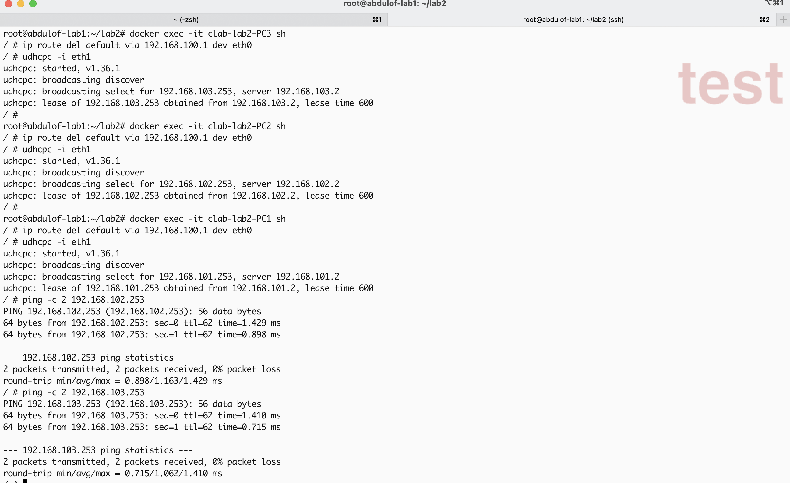
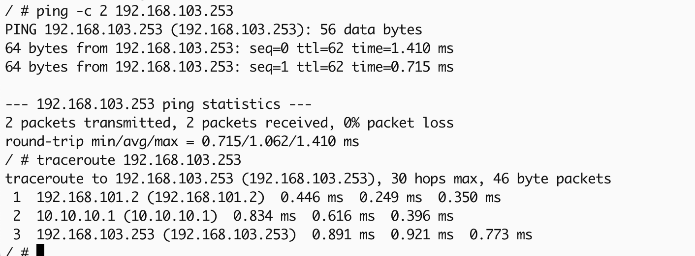
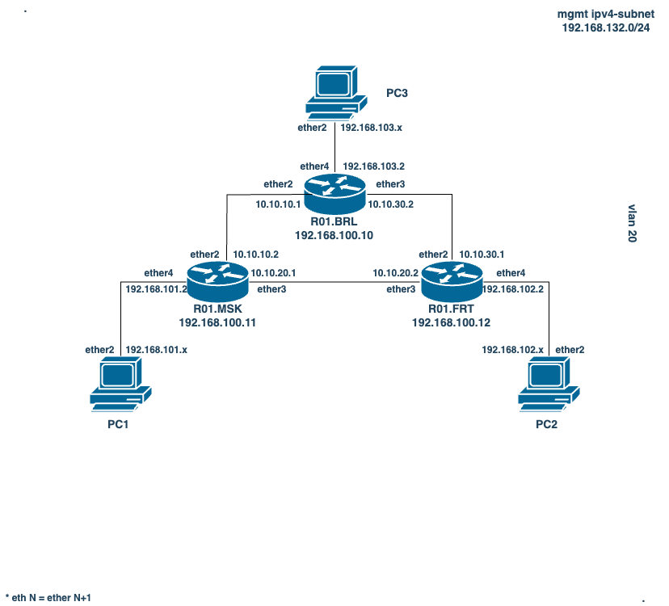
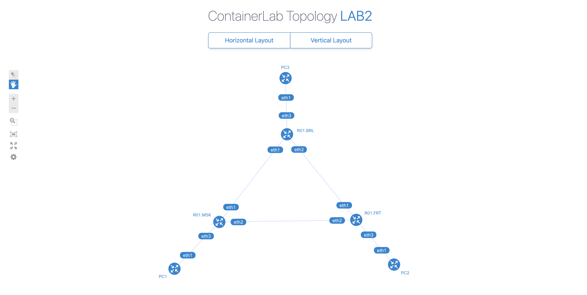

University: [ITMO University](https://itmo.ru/ru/)

Faculty: [FICT](https://fict.itmo.ru)

Course: [Introduction in routing](https://github.com/itmo-ict-faculty/introduction-in-routing)

Year: 2024/2025

Group: K3321

Author: Abdulov Ilia Alex

Lab: Lab2

Date created: 16.10.2024

Date finished: 06.11.2024

## Prerequisites

Перед выполнением лабораторной работы выполним следующие задачи:
- установим [Docker Engine on Ubuntu](https://docs.docker.com/engine/install/ubuntu/)
- установим пакет *build-essential*: ```sudo apt install build-essential -y```
- склонируем репозиторий *hellt/vrnetlab*: ```git clone https://github.com/hellt/vrnetlab.git```
- установим routeros: ```cd vrnetlab/routeros/; wget https://download.mikrotik.com/routeros/6.47.9/chr-6.47.9.vmdk; make docker-image```
- установим ContainerLab: ```sudo bash -c "$(curl -sL https://get.containerlab.dev)"```
- установим qemu-kvm по инструкции [Installation of KVM](https://help.ubuntu.com/community/KVM/Installation): ```sudo apt-get install qemu-kvm libvirt-daemon-system libvirt-clients bridge-utils```, проверим запуск kvm командой *kvm-ok*

## Основная часть лабораторной работы

Напишем [clab yaml](lab2.clab.yaml) и сделаем deploy, убедимся в stdout не возникло ошибок.

Настроим конфигурации на устройствах:

- R01.BRL

```mikrotik
/ip pool
add name=pool_brl ranges=192.168.103.3-192.168.103.253
/ip dhcp-server
add address-pool=pool_brl disabled=no interface=ether4 name=dhcp_brl
/ip address
add address=10.10.10.1/24 interface=ether2
add address=10.10.30.2/24 interface=ether3
add address=192.168.103.2/24 interface=ether4
/ip dhcp-server network
add address=192.168.103.0/24 gateway=192.168.103.2
/ip route
add distance=1 dst-address=192.168.101.0/24 gateway=10.10.10.2
add distance=1 dst-address=192.168.102.0/24 gateway=10.10.30.1
/system identity
set name=R01.BRL
```

- R01.MSK

```mikrotik
/ip pool
add name=pool_msk ranges=192.168.101.3-192.168.101.253
/ip dhcp-server
add address-pool=pool_msk disabled=no interface=ether4 name=dhcp_msk
/ip address
add address=10.10.10.2/24 interface=ether2
add address=10.10.20.1/24 interface=ether3
add address=192.168.101.2/24 interface=ether4
/ip dhcp-server network
add address=192.168.101.0/24 gateway=192.168.101.2
/ip route
add distance=1 dst-address=192.168.103.0/24 gateway=10.10.10.1
add distance=1 dst-address=192.168.102.0/24 gateway=10.10.20.2
/system identity
set name=R01.MSK
```

- R01.FRT

```mikrotik
/ip pool
add name=pool_frt ranges=192.168.102.3-192.168.102.253
/ip dhcp-server
add address-pool=pool_frt disabled=no interface=ether4 name=dhcp_frt
/ip address
add address=10.10.30.1/24 interface=ether2
add address=10.10.20.2/24 interface=ether3
add address=192.168.102.2/24 interface=ether4
/ip dhcp-server network
add address=192.168.102.0/24 gateway=192.168.102.2
/ip route
add distance=1 dst-address=192.168.103.0/24 gateway=10.10.30.2
add distance=1 dst-address=192.168.101.0/24 gateway=10.10.20.1
/system identity
set name=R01.FRT
```

- PC

```sh
udhcpc -i eth1
```

## Результаты

Убедимся, что всем компьютерам выдаются статические адреса от dhcp-сервера, также сразу убедимся, что ping доходит до двух других компьютеров:

Адреса успешно получены от dhcp-сервера и ping PC2, PC3 проходит.

Проверим по схеме, что пакет проходит правильный маршрут от PC1 до PC3:

Маршрут сходится с указанным на схеме ниже.

Схема сети связи в трех геораспределенных офисах "RogaIKopita Games":



