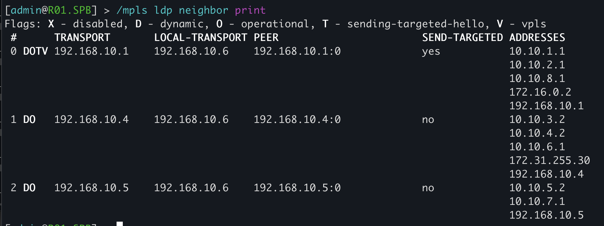

University: [ITMO University](https://itmo.ru/ru/)

Faculty: [FICT](https://fict.itmo.ru)

Course: [Introduction in routing](https://github.com/itmo-ict-faculty/introduction-in-routing)

Year: 2024/2025

Group: K3321

Author: Abdulov Ilia Alex

Lab: Lab3

Date of create: 15.12.2024

Date of finished: 

## Выполнение лабораторной работы

Нарисуем схему корпоративной сети связи для компании "RogaIKopita Games":


Напишем [network.clab.yaml](network.clab.yaml) и сделаем *deploy*, далее начнем настраивать конфигурацию каждого сетевого устройства.

<!-- список использованных источников
https://habr.com/ru/articles/169103/
-->

<!--
ssh-keygen -f '/root/.ssh/known_hosts' -R '192.168.100.2'; ssh-keygen -f '/root/.ssh/known_hosts' -R '192.168.100.3'; ssh-keygen -f '/root/.ssh/known_hosts' -R '192.168.100.4'; ssh-keygen -f '/root/.ssh/known_hosts' -R '192.168.100.5'; ssh-keygen -f '/root/.ssh/known_hosts' -R '192.168.100.6'; ssh-keygen -f '/root/.ssh/known_hosts' -R '192.168.100.7'
-->

#### R01.NY (192.168.100.2):

```mikrotik
/interface bridge
add name=loopback
add name=vpn

/interface vpls
add disabled=no l2mtu=1500 name=EoMPLS remote-peer=192.168.10.6 vpls-id=250:250

/interface wireless security-profiles
set [ find default=yes ] supplicant-identity=MikroTik

/routing ospf instance
set [ find default=yes ] router-id=192.168.10.1

/interface bridge port
add bridge=vpn interface=ether5
add bridge=vpn interface=EoMPLS

/ip address
add address=192.168.10.1 interface=loopback network=192.168.10.1
add address=10.10.1.1/30 interface=ether3 network=10.10.1.0
add address=10.10.2.1/30 interface=ether4 network=10.10.2.0
add address=10.10.8.1/30 interface=ether5 network=10.10.8.0
add address=172.16.0.2/24 interface=vpn network=172.16.0.0

/mpls ldp
set enabled=yes lsr-id=192.168.10.1 transport-address=192.168.10.1
/mpls ldp interface
add interface=ether3
add interface=ether4
add interface=ether5

/routing ospf network
add area=backbone network=192.168.10.1/32
add area=backbone network=10.10.1.0/30
add area=backbone network=10.10.2.0/30

/system identity
set name=R01.NY
```

#### R01.LND (192.168.100.3):

```mikrotik
/interface bridge
add name=loopback

/interface wireless security-profiles
set [ find default=yes ] supplicant-identity=MikroTik

/routing ospf instance
set [ find default=yes ] router-id=192.168.10.2

/ip address
add address=192.168.10.2 interface=loopback network=192.168.10.2
add address=10.10.1.2/30 interface=ether3 network=10.10.1.0
add address=10.10.3.1/30 interface=ether4 network=10.10.3.0

/mpls ldp
set enabled=yes lsr-id=192.168.10.2 transport-address=192.168.10.2
/mpls ldp interface
add interface=ether3
add interface=ether4

/routing ospf network
add area=backbone network=192.168.10.2/32
add area=backbone network=10.10.1.0/30
add area=backbone network=10.10.3.0/30

/system identity
set name=R01.LND
```

#### R01.HKI (192.168.100.4):

```mikrotik
/interface bridge
add name=loopback

/interface wireless security-profiles
set [ find default=yes ] supplicant-identity=MikroTik

/routing ospf instance
set [ find default=yes ] router-id=192.168.10.4

/ip address
add address=192.168.10.4 interface=loopback network=192.168.10.4
add address=10.10.6.1/30 interface=ether3 network=10.10.6.0
add address=10.10.4.2/30 interface=ether5 network=10.10.4.0
add address=10.10.3.2/30 interface=ether4 network=10.10.3.0

/mpls ldp
set enabled=yes lsr-id=192.168.10.4 transport-address=192.168.10.4
/mpls ldp interface
add interface=ether3
add interface=ether4
add interface=ether5

/routing ospf network
add area=backbone network=192.168.10.4/32
add area=backbone network=10.10.3.0/30
add area=backbone network=10.10.6.0/30
add area=backbone network=10.10.4.0/30

/system identity
set name=R01.HKI
```

#### R01.LBN (192.168.100.5):

```mikrotik
/interface bridge
add name=loopback

/interface wireless security-profiles
set [ find default=yes ] supplicant-identity=MikroTik

/routing ospf instance
set [ find default=yes ] router-id=192.168.10.3

/ip address
add address=192.168.10.3 interface=loopback network=192.168.10.3
add address=10.10.5.1/30 interface=ether3 network=10.10.5.0
add address=10.10.2.2/30 interface=ether4 network=10.10.2.0
add address=10.10.4.1/30 interface=ether5 network=10.10.4.0

/mpls ldp
set enabled=yes lsr-id=192.168.10.3 transport-address=192.168.10.3
/mpls ldp interface
add interface=ether3
add interface=ether4
add interface=ether5

/routing ospf network
add area=backbone network=192.168.10.3/32
add area=backbone network=10.10.2.0/30
add area=backbone network=10.10.4.0/30
add area=backbone network=10.10.5.0/30

/system identity
set name=R01.LBN
```

#### R01.MSC (192.168.100.6):

```mikrotik
/interface bridge
add name=loopback

/routing ospf instance
set [ find default=yes ] router-id=192.168.10.5

/ip address
add address=192.168.10.5 interface=loopback network=192.168.10.5
add address=10.10.5.2/30 interface=ether3 network=10.10.5.0
add address=10.10.7.1/30 interface=ether4 network=10.10.7.0

/mpls ldp
set enabled=yes lsr-id=192.168.10.5 transport-address=192.168.10.5
/mpls ldp interface
add interface=ether3
add interface=ether4

/routing ospf network
add area=backbone network=192.168.10.5/32
add area=backbone network=10.10.5.0/30
add area=backbone network=10.10.7.0/30

/system identity
set name=R01.MSC
```

#### R01.SPB (192.168.100.7):

```mikrotik
/interface bridge
add name=loopback
add name=vpn

/interface vpls
add disabled=no l2mtu=1500 name=EoMPLS remote-peer=192.168.10.1 vpls-id=250:250

/interface wireless security-profiles
set [ find default=yes ] supplicant-identity=MikroTik

/routing ospf instance
set [ find default=yes ] router-id=192.168.10.6

/interface bridge port
add bridge=vpn interface=ether5
add bridge=vpn interface=EoMPLS

/ip address
add address=192.168.10.6 interface=loopback network=192.168.10.6
add address=172.16.0.1/24 interface=vpn network=172.16.0.0
add address=10.10.6.2/30 interface=ether3 network=10.10.6.0
add address=10.10.7.2/30 interface=ether4 network=10.10.7.0
add address=10.10.9.1/30 interface=ether5 network=10.10.9.0

/mpls ldp
set enabled=yes lsr-id=192.168.10.6 transport-address=192.168.10.6
/mpls ldp interface
add interface=ether3
add interface=ether4
add interface=ether5

/routing ospf network
add area=backbone network=192.168.10.6/32
add area=backbone network=10.10.6.0/30
add area=backbone network=10.10.7.0/30
add area=backbone network=10.10.9.0/30

/system identity
set name=R01.SPB
```

#### SGI Prism (docker exec -it clab-lab3-SGI-PRISM sh):

```sh
ip add add 172.16.0.24/24 dev eth2
```

#### PC1 (docker exec -it clab-lab3-PC1 sh):

```sh
ip add add 172.16.0.25/24 dev eth2
```

## Результаты

Успешные ping между SGI-PRISM (172.16.0.24) и PC1 (172.16.0.25):


Результат traceroute от R01.NY до R01.SPB:


Таблицы меток MPLS для R01.NY и R01.SPB:


