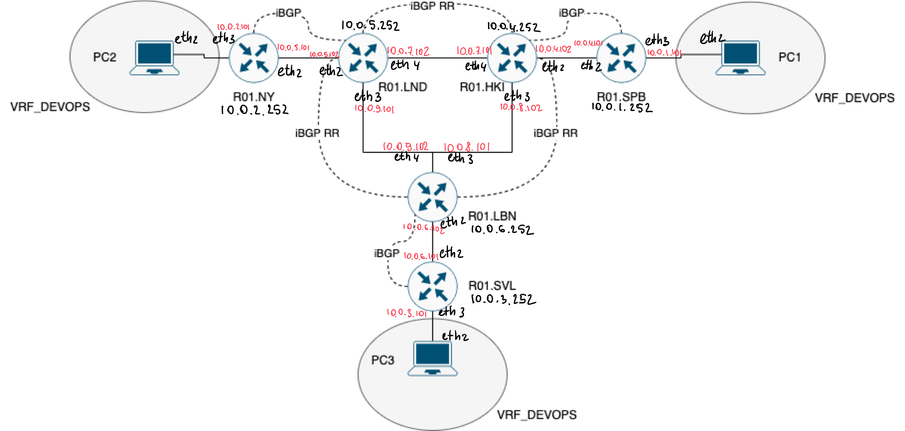

University: [ITMO University](https://itmo.ru/ru/)

Faculty: [FICT](https://fict.itmo.ru)

Course: [Introduction in routing](https://github.com/itmo-ict-faculty/introduction-in-routing)

Year: 2024/2025

Group: K3321

Author: Abdulov Ilia Alex

Lab: Lab4

Date of create: 23.12.2024

Date of finished: 

## Описание

Компания "RogaIKopita Games" выпустила игру "Allmoney Impact", нагрузка на арендные сервера возрасли и вам поставлена задача стать LIR и организовать свою AS чтобы перенести все сервера игры на свою инфраструктуру. После организации вашей AS коллеги из отдела DEVOPS попросили вас сделать L3VPN между 3 офисами для служебных нужд. (Рисунок 1) Данный L3VPN проработал пару недель и коллеги из отдела DEVOPS попросили вас сделать VPLS для служебных нужд.

## Цель работы

Изучить протоколы BGP, MPLS и правила организации L3VPN и VPLS.

## Выполнение лабораторной работы

Сделаем IP/MPLS сеть связи для "RogaIKopita Games". Создадим все устройства указанные на схеме и соединения между ними [network.clab.yaml](network.clab.yaml):



Начнем настраивать конфигурацию каждого сетевого устройства для первой части лабораторной работы. Настроим iBGP RR Cluster.Настроим VRF, RD и RT на 3 роутерах, IP адреса в VRF.

<!--
ssh-keygen -f '/root/.ssh/known_hosts' -R '192.168.20.8'; ssh-keygen -f '/root/.ssh/known_hosts' -R '192.168.20.3'; ssh-keygen -f '/root/.ssh/known_hosts' -R '192.168.20.4'; ssh-keygen -f '/root/.ssh/known_hosts' -R '192.168.20.5'; ssh-keygen -f '/root/.ssh/known_hosts' -R '192.168.20.6'; ssh-keygen -f '/root/.ssh/known_hosts' -R '192.168.20.7'; ssh-keygen -f '/root/.ssh/known_hosts' -R '192.168.20.9'; ssh-keygen -f '/root/.ssh/known_hosts' -R '192.168.20.10'; ssh-keygen -f '/root/.ssh/known_hosts' -R '192.168.20.11';
-->

#### R01.NY:

```mikrotik
/interface bridge
add name=loopback

/routing bgp instance
set default as=65500 router-id=10.0.2.252

/routing ospf instance
set [ find default=yes ] router-id=10.0.2.252

/ip address
add address=10.0.2.252/32 interface=loopback network=10.0.2.252
add address=10.0.2.101/30 interface=ether4 network=10.0.2.100
add address=10.0.5.101/30 interface=ether3 network=10.0.5.100

/ip dhcp-client
add disabled=no interface=ether1

/ip route vrf
add export-route-targets=65500:100 import-route-targets=65500:100 interfaces=ether4 route-distinguisher=65500:100 routing-mark=vrf1

/mpls ldp
set enabled=yes lsr-id=10.0.2.252 transport-address=10.0.2.252

/mpls ldp interface
add interface=ether3
add interface=ether4

/routing bgp instance vrf
add redistribute-connected=yes redistribute-ospf=yes routing-mark=vrf1

/routing bgp peer
add address-families=vpnv4 name=peer1 remote-address=10.0.5.252 remote-as=\
    65500 update-source=loopback
    
/routing ospf network
add area=backbone network=10.0.2.100/30
add area=backbone network=10.0.5.100/30
add area=backbone network=10.0.2.252/32
```

#### R01.LND:

```mikrotik
/interface bridge
add name=loopback

/routing bgp instance
set default as=65500 router-id=10.0.5.252

/routing ospf instance
set [ find default=yes ] router-id=10.0.5.252

/ip address
add address=10.0.5.252/32 interface=loopback network=10.0.5.252
add address=10.0.5.102/30 interface=ether3 network=10.0.5.100
add address=10.0.9.101/30 interface=ether4 network=10.0.9.100
add address=10.0.7.102/30 interface=ether5 network=10.0.7.100


/ip dhcp-client
add disabled=no interface=ether1

/mpls ldp
set enabled=yes lsr-id=10.0.5.252 transport-address=10.0.5.252

/mpls ldp interface
add interface=ether3
add interface=ether4
add interface=ether5

/routing bgp peer
add address-families=vpnv4 name=peer1 remote-address=10.0.2.252 \
    remote-as=65500 update-source=loopback
add address-families=vpnv4 name=peer2 remote-address=10.0.6.252 \
    remote-as=65500 route-reflect=yes update-source=loopback
add address-families=vpnv4 name=peer3 remote-address=10.0.4.252 \
    remote-as=65500 route-reflect=yes update-source=loopback
    
/routing ospf network
add area=backbone network=10.0.5.100/30
add area=backbone network=10.0.9.100/30
add area=backbone network=10.0.7.100/30
add area=backbone network=10.0.5.252/32
```

#### R01.LBN:

```mikrotik
/interface bridge
add name=loopback

/routing bgp instance
set default as=65500 router-id=10.0.6.252

/routing ospf instance
set [ find default=yes ] router-id=10.0.6.252

/ip address
add address=10.0.6.252/32 interface=loopback network=10.0.6.252
add address=10.0.6.102/30 interface=ether3 network=10.0.6.100
add address=10.0.8.101/30 interface=ether4 network=10.0.8.100
add address=10.0.9.102/30 interface=ether5 network=10.0.9.100


/ip dhcp-client
add disabled=no interface=ether1

/mpls ldp
set enabled=yes lsr-id=10.0.6.252 transport-address=10.0.6.252

/mpls ldp interface
add interface=ether3
add interface=ether4
add interface=ether5

/routing bgp peer
add address-families=vpnv4 name=peer1 remote-address=10.0.3.252 \
    remote-as=65500 update-source=loopback
add address-families=vpnv4 name=peer2 remote-address=10.0.4.252 \
    remote-as=65500 route-reflect=yes update-source=loopback
add address-families=vpnv4 name=peer3 remote-address=10.0.5.252 \
    remote-as=65500 route-reflect=yes update-source=loopback
    
/routing ospf network
add area=backbone network=10.0.6.100/30
add area=backbone network=10.0.8.100/30
add area=backbone network=10.0.9.100/30
add area=backbone network=10.0.6.252/32
```

#### R01.SVL:

```mikrotik
/interface bridge
add name=loopback

/routing bgp instance
set default as=65500 router-id=10.0.3.252

/routing ospf instance
set [ find default=yes ] router-id=10.0.3.252

/ip address
add address=10.0.3.252/32 interface=loopback network=10.0.3.252
add address=10.0.3.101/30 interface=ether4 network=10.0.3.100
add address=10.0.6.101/30 interface=ether3 network=10.0.6.100

/ip dhcp-client
add disabled=no interface=ether1

/ip route vrf
add export-route-targets=65500:100 import-route-targets=65500:100 interfaces=ether4 route-distinguisher=65500:100 routing-mark=vrf1

/mpls ldp
set enabled=yes lsr-id=10.0.3.252 transport-address=10.0.3.252

/mpls ldp interface
add interface=ether3
add interface=ether4

/routing bgp instance vrf
add redistribute-connected=yes redistribute-ospf=yes routing-mark=vrf1

/routing bgp peer
add address-families=vpnv4 name=peer1 remote-address=10.0.6.252 remote-as=\
    65500 update-source=loopback
    
/routing ospf network
add area=backbone network=10.0.3.100/30
add area=backbone network=10.0.6.100/30
add area=backbone network=10.0.3.252/32
```

#### R01.HKI:

```mikrotik
/interface bridge
add name=loopback

/routing bgp instance
set default as=65500 router-id=10.0.4.252

/routing ospf instance
set [ find default=yes ] router-id=10.0.4.252

/ip address
add address=10.0.4.252/32 interface=loopback network=10.0.4.252
add address=10.0.4.102/30 interface=ether3 network=10.0.4.100
add address=10.0.7.101/30 interface=ether5 network=10.0.7.100
add address=10.0.8.102/30 interface=ether4 network=10.0.8.100

/ip dhcp-client
add disabled=no interface=ether1

/mpls ldp
set enabled=yes lsr-id=10.0.4.252 transport-address=10.0.4.252

/mpls ldp interface
add interface=ether3
add interface=ether4
add interface=ether5

/routing bgp peer
add address-families=vpnv4 name=peer1 remote-address=10.0.1.252 \
    remote-as=65500 update-source=loopback
add address-families=vpnv4 name=peer2 remote-address=10.0.5.252 \
    remote-as=65500 route-reflect=yes update-source=loopback
add address-families=vpnv4 name=peer3 remote-address=10.0.6.252 \
    remote-as=65500 route-reflect=yes update-source=loopback
    
/routing ospf network
add area=backbone network=10.0.4.100/30
add area=backbone network=10.0.7.100/30
add area=backbone network=10.0.8.100/30
add area=backbone network=10.0.4.252/32
```

#### R01.SPB:

```mikrotik
/interface bridge
add name=loopback

/routing bgp instance
set default as=65500 router-id=10.0.1.252

/routing ospf instance
set [ find default=yes ] router-id=10.0.1.252

/ip address
add address=10.0.1.252/32 interface=loopback network=10.0.1.252
add address=10.0.1.101/30 interface=ether4 network=10.0.1.100
add address=10.0.4.101/30 interface=ether3 network=10.0.4.100

/ip dhcp-client
add disabled=no interface=ether1

/ip route vrf
add export-route-targets=65500:100 import-route-targets=65500:100 interfaces=ether4 route-distinguisher=65500:100 routing-mark=vrf1

/mpls ldp
set enabled=yes lsr-id=10.0.1.252 transport-address=10.0.1.252

/mpls ldp interface
add interface=ether3
add interface=ether4

/routing bgp instance vrf
add redistribute-connected=yes redistribute-ospf=yes routing-mark=vrf1

/routing bgp peer
add address-families=vpnv4 name=peer1 remote-address=10.0.4.252 remote-as=\
    65500 update-source=loopback
    
/routing ospf network
add area=backbone network=10.0.1.100/30
add area=backbone network=10.0.4.100/30
add area=backbone network=10.0.1.252/32
```


